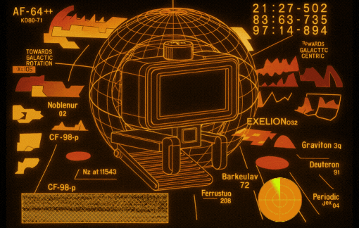

[](https://creativecommons.org/licenses/by-sa/4.0/)  [](https://webscreen.cc) [](https://www.crowdsupply.com/hw-media-lab/webscreen)

# WebScreen Serial IDE



A modern, web-based integrated development environment for WebScreen devices with dual theme support, providing serial communication, code editing, and command execution capabilities.

## Features

### **Core Features**
- **Serial Communication**: Direct Web Serial API connection to WebScreen devices
- **Dual Theme System**: Switch between "Retro" (amber phosphor) and "Focus" (VS Code-like) themes
- **Tabbed Interface**: Organized workspace with Serial Console, JavaScript Editor, and File Manager
- **URL Theme Selection**: Set theme via URL parameter (`?mode=retro` or `?mode=focus`)
- **Real-time Terminal**: Live serial console with command history, auto-completion, and ANSI color rendering (16 basic colors + bold)
- **File Management**: Upload, list, download, and manage files on the device
- **Screenshot Capture**: Grab the device display via `/screenshot`, preview it in a modal, and save it as PNG
- **Verified Uploads**: File uploads wait for the firmware acknowledgement (`[OK] File saved:` / `[ERROR] Upload failed:`) instead of fixed delays, so failures surface immediately

### **Code Editor**
- **Syntax Highlighting**: JavaScript syntax highlighting with theme-appropriate colors
- **IntelliSense**: Auto-completion with WebScreen API suggestions
- **Line Numbers**: Easy navigation with contextual line numbering
- **Bracket Matching**: Automatic bracket pairing and highlighting
- **Code Folding**: Collapse code blocks for better navigation
- **Search & Replace**: Built-in search functionality (Ctrl+F)
- **Keyboard Shortcuts**: 
  - `Ctrl+S`: Save file to device
  - `F5`: Run script on device
  - `Ctrl+/`: Toggle comments
  - `Ctrl+Space`: Trigger autocomplete

### **Device Workflow Tools**
- **Run & Set as Default**: Second run button sends `/load <file> save`, persisting the script as the boot default in `webscreen.json`
- **Eval Selection**: Send the current editor selection (or current line) to the running app via `/eval` (max 255 chars) for live REPL-style tweaking
- **Errors Quick Button**: One-click `/errors` to show the last JavaScript error and line number after a failed run
- **Screenshot Button**: Camera icon in the toolbar sends `/screenshot`, decodes the RGB565 stream, renders it to a canvas overlay, and offers a "Download PNG" export (30s timeout; disabled while disconnected or capturing)

### **Theme System**
#### Retro Theme
- **Amber Phosphor Colors**: Classic orange/yellow terminal aesthetic
- **Scan Line Effects**: Authentic CRT monitor simulation
- **Glowing Elements**: Neon effects on buttons and text
- **Terminal Animation**: Animated background with retro styling

#### Focus Theme
- **VS Code Inspired**: Clean, modern development environment
- **Reduced Eye Strain**: Muted colors perfect for long coding sessions
- **No Animations**: Distraction-free interface
- **Professional Layout**: Clean typography and spacing

### **Serial Commands**
All WebScreen serial commands are supported with terminal tab-completion:
- **Core**: `/help`, `/stats`, `/info`, `/reboot`, `/brightness`, `/time`, `/settime`, `/screenshot` (alias `/ss`), `/factory_reset confirm`
- **File Operations**: `/write`, `/upload` (firmware replies `[OK] File saved: <name> (<size>)` or `[ERROR] Upload failed: <reason>` after `END`), `/download <file>` (binary-safe base64 download), `/ls <path> [json]` (plain listing ends with `Total: N files, M directories`; `json` returns a single-line JSON object), `/cat`, `/rm`, `/mkdir <path>`
- **Network**: `/wget` (alias `fetch`; the old `download` alias now refers to the `/download` file transfer), `/ping`
- **Configuration**: `/config get/set`, `/backup`
- **Monitoring**: `/monitor cpu/mem/net`, `/errors`, `/gc`
- **Script Management**: `/load` (with optional `save` to persist as default), `/restart_app`, `/eval`

### **User Interface**
- **Responsive Design**: Works on desktop and tablet devices
- **Tabbed Workspace**: Separate areas for console, editor, and files
- **Quick Commands**: One-click access to common WebScreen commands
- **API Documentation**: Built-in reference for WebScreen JavaScript API
- **Status Bar**: Real-time connection info with WebScreen branding
- **Credits Section**: Creative Commons licensing information

## Getting Started

### Prerequisites
- **Browser**: Chrome, Edge, or Opera (Web Serial API support required)
- **WebScreen Device**: Connected via USB with serial commands firmware

### Usage

1. **Open the IDE**

   The app is pure static HTML/JS (no backend required). Either open `public/index.html` directly in a supported browser, or serve the `public/` directory with any static file server:
   ```bash
   python3 -m http.server -d public
   # or
   npx serve public
   ```
   (DDEV also works if you already use it, but PHP is not required.)

2. **Choose Theme** (Optional)
   ```
   Add theme parameter to URL:
   - file:///path/to/public/index.html?mode=retro  (amber phosphor theme)
   - file:///path/to/public/index.html?mode=focus  (clean development theme)
   ```

3. **Connect Device**
   - Click "Connect Device" button
   - Select your WebScreen device from the serial port list
   - Wait for successful connection

4. **Navigate Interface**
   - **Serial Console**: Direct command-line interaction
   - **JavaScript Editor**: Write and edit WebScreen applications
   - **File Manager**: Browse and manage device files

5. **Write Code**
   - Use the JavaScript editor with full syntax highlighting
   - Take advantage of WebScreen API autocomplete
   - Save your work with Ctrl+S or the Save button

6. **Execute Commands**
   - Use the terminal to execute serial commands
   - Try quick commands like `/stats` or `/help`
   - Upload and run scripts with F5 or the Run button

### Example JavaScript Code

```javascript
"use strict";

// Create styles (colors as hex integers, not strings)
let style = create_style();
style_set_text_font(style, 48);        // Use available sizes: 14,20,28,34,40,44,48
style_set_text_color(style, 0xFFFFFF); // White text
style_set_text_align(style, 1);        // Center align

// Create and style a label
let label = create_label(268, 120);    // x, y position
obj_add_style(label, style, 0);
label_set_text(label, "Hello WebScreen!");

// Network example with custom port
let response = http_get("http://192.168.1.20:2000/api/data");
let value = parse_json_value(response, "temperature");
print("Temperature: " + value);

// Storage example
sd_write_file("/config.txt", "My configuration");
let config = sd_read_file("/config.txt");
print("Config loaded: " + config);

// Timer callback (function name as string)
let update = function() {
  label_set_text(label, "Updated!");
};
create_timer("update", 1000);
```

## Development Workflow

### 1. **Rapid Prototyping**
```
1. Choose your preferred theme (Retro for creative work, Focus for long sessions)
2. Write JavaScript code in the editor with API autocomplete
3. Press F5 to upload and run immediately
4. See results on WebScreen display
5. Iterate quickly without SD card swapping
```

### 2. **File Management**
```
1. Switch to File Manager tab
2. Use /ls to see existing files
3. Save scripts with custom filenames
4. Download files for backup
5. Load different applications with /load
```

### 3. **System Monitoring**
```
1. Use Serial Console for real-time monitoring
2. Use /stats to monitor memory usage
3. Use /monitor for continuous system stats
4. Use /ping to test network connectivity
5. Debug issues with live serial output
```

### 4. **Theme Selection**
```
URL Parameters:
- ?mode=retro  - Amber phosphor terminal theme
- ?mode=focus  - Clean VS Code-like theme

Button Toggle:
- Click theme button in header to switch themes
- Theme preference is saved automatically
```

## Technical Details

### Architecture
- **Frontend**: Vanilla JavaScript with CodeMirror editor
- **Serial Communication**: Web Serial API for device connection
- **Theming**: CSS custom properties with dual-theme system
- **UI Framework**: Tabbed interface with responsive design
- **No Backend**: Pure client-side application

### Theme System
- **CSS Variables**: Dynamic theme switching using custom properties
- **LocalStorage**: Theme preference persistence
- **URL Parameters**: Direct theme selection via query strings
- **CodeMirror Integration**: Editor themes sync with UI themes

### Browser Compatibility
- ✅ **Chrome 89+**: Full support
- ✅ **Edge 89+**: Full support  
- ✅ **Opera 75+**: Full support
- ❌ **Firefox**: No Web Serial API support
- ❌ **Safari**: No Web Serial API support

### File Structure
```
WebScreen-Serial-IDE/
├── public/                 # Static docroot
│   ├── index.html          # Main HTML with tabbed interface
│   ├── style.css           # Dual-theme CSS system
│   ├── serial.js           # Serial communication manager
│   ├── app.js              # Main application with theme management
│   └── assets/
│       ├── animation.gif   # Terminal animation for retro theme
│       ├── logo.png        # WebScreen logo
│       └── favicon.ico     # Browser favicon
└── README.md               # This documentation
```

## API Reference

### SerialManager Class
Core serial communication functionality:

```javascript
// Connection management
await serial.connect()
await serial.disconnect()

// Command execution with auto-completion
await serial.sendCommand('/help')
await serial.sendFile('script.js', content)

// WebScreen specific methods
await serial.getStats()
await serial.listFiles()
await serial.deleteFile('/old.js')
await serial.makeDirectory('/data')      // /mkdir
await serial.loadScript('app.js')        // run once
await serial.loadScript('app.js', true)  // run & set as boot default
await serial.backup('save', 'production')
await serial.captureScreenshot()         // -> { width, height, format, swap, bytes }
await serial.factoryReset()              // /factory_reset confirm
```

### WebScreenIDE Class
Main application controller with theme management:

```javascript
// Editor operations
ide.saveFile()          // resolves true once the upload completes
ide.runScript()         // save, then /load
ide.runScript(true)     // save, then /load <file> save (set as default)
ide.evalSelection()     // send editor selection via /eval
ide.captureScreenshot() // /screenshot -> canvas modal with Download PNG
ide.downloadLog()       // export terminal log as .txt
ide.clearTerminal()

// Theme management
ide.loadTheme()           // Load theme from URL or localStorage
ide.setTheme('retro')     // Set specific theme
ide.toggleTheme()         // Switch between themes

// UI management
ide.switchTab('files')    // Switch between Console/Editor/Files
ide.updateConnectionStatus(connected)
ide.appendToTerminal(message, className)
```

### Theme Management
```javascript
// URL parameter theme selection
// ?mode=retro or ?mode=focus

// Manual theme switching
const ide = window.webScreenIDE;
ide.setTheme('retro');    // Amber phosphor theme
ide.setTheme('focus');    // VS Code theme
```

## Customization

### Adding Custom Themes
Modify CSS custom properties to create new themes:

```css
[data-theme="custom"] {
    --color-primary: #00ff00;
    --bg-primary: #001100;
    --shadow-glow: 0 0 10px #00ff00;
    /* ... other theme variables */
}
```

### Custom Quick Commands
Add custom commands by modifying the HTML:

```html
<button class="cmd-btn" data-cmd="/custom command">Custom</button>
```

### Editor Customization
Modify keyboard shortcuts and editor behavior:

```javascript
extraKeys: {
    'Ctrl-R': () => this.runScript(),
    'Ctrl-Shift-S': () => this.saveAs(),
    'F1': () => this.showHelp(),
}
```

## Troubleshooting

### Connection Issues
- **Device not found**: Ensure WebScreen is connected via USB and drivers are installed
- **Permission denied**: Try disconnecting and reconnecting the device
- **Port busy**: Close other serial applications (Arduino IDE, etc.)

### Theme Issues
- **Theme not loading**: Check URL parameter spelling (`mode=retro` or `mode=focus`)
- **Theme not persisting**: Ensure localStorage is enabled in browser
- **Mixed theme elements**: Hard refresh the page (Ctrl+F5)

### Editor Issues
- **Syntax highlighting not working**: Check if JavaScript mode is loaded
- **Autocomplete not working**: Ensure show-hint addon is loaded
- **Slow performance**: Clear terminal history or reduce editor content

### Serial Communication
- **Commands not working**: Verify device is running serial commands firmware
- **Garbled output**: Check baud rate (should be 115200)
- **Timeout errors**: Ensure stable USB connection

## WebScreen API Reference

### Display Functions
- `create_label(x, y)` - Create a label at position, returns handle
- `label_set_text(label, 'text')` - Set label text
- `create_image('filename')` - Display an image file
- `draw_rect(x, y, w, h, color)` - Draw a colored rectangle (color as 0xRRGGBB)
- `show_gif_from_sd('/file.gif', x, y)` - Display animated GIF at position
- `set_brightness(value)` - Set display brightness (0-255)
- `get_brightness()` - Get current display brightness

### Network Functions
- `wifi_connect('ssid', 'pass')` - Connect to WiFi network
- `http_get('url')` - HTTP GET (supports custom ports: `http://host:port/path`)
- `http_post('url', data)` - HTTP POST (supports custom ports)
- `http_delete('url')` - HTTP DELETE (supports custom ports)

### Storage Functions
- `sd_write_file('path', data)` - Write data to SD card file
- `sd_read_file('path')` - Read data from SD card file
- `sd_list_dir('/')` - List files in directory

### Style Functions
- `create_style()` - Create a style object
- `style_set_text_font(style, size)` - Set font size (14, 20, 28, 34, 40, 44, 48 only)
- `style_set_text_color(style, 0xRRGGBB)` - Set text color
- `style_set_bg_color(style, 0xRRGGBB)` - Set background color
- `obj_add_style(obj, style, 0)` - Apply style to object

### Utility Functions
- `delay(milliseconds)` - Pause execution for specified time
- `print(message)` - Output message to serial console
- `parse_json_value(json, key)` - Extract value from JSON string
- `create_timer('callback_name', interval_ms)` - Create periodic timer

## LVGL Configuration Reference

### Available Font Sizes
Only these Montserrat sizes are enabled in the firmware:

| Size | Recommended Use |
|------|-----------------|
| 14 | Default, small text |
| 20 | Body text |
| 28 | Subheadings |
| 34 | Medium headings |
| 40 | Large headings |
| 44 | Extra large |
| 48 | Display text |

**Important:** Sizes like 16, 24, 32 are NOT available.

### Supported Image Formats
- **PNG** ✅ - Recommended for icons and graphics
- **GIF** ✅ - Animated images (keep under 50KB)
- **SJPG** ✅ - Split JPG for large images
- **BMP** ❌ - Not supported

### Enabled Widgets
Label, Image, Arc, Line, Button, Button Matrix, Canvas, Chart, Meter, Message Box, Span

### Memory Guidelines
- Elk JS heap: 256KB (PSRAM)
- Keep scripts under 3KB for stability
- Limit to 5 styles and 10 labels per app

## Contributing

### Development Setup
1. Clone the repository
2. Open `public/index.html` in a supported browser (or run `python3 -m http.server -d public`)
3. Connect a WebScreen device for testing
4. Test both themes with URL parameters
5. Make modifications and test locally

### Adding Features
- **New Themes**: Extend CSS custom properties system
- **New Commands**: Add to SerialManager class methods
- **UI Components**: Modify HTML structure and CSS styling
- **Editor Features**: Extend CodeMirror configuration

### Getting Help

| Type | Resource | Description |
|------|----------|-------------|
| 🐛 **Bug Reports** | [GitHub Issues](https://github.com/HW-Lab-Hardware-Design-Agency/WebScreen-Serial-IDE/issues) | Report bugs and request features |
| 💬 **Discussions** | [GitHub Discussions](https://github.com/HW-Lab-Hardware-Design-Agency/WebScreen-Serial-IDE/discussions) | Ask questions and share ideas |
| 📖 **Documentation** | [docs/](docs/) | API reference and guides |
| 🌐 **Website** | [WebScreen.cc](https://webscreen.cc) | Official project website |
| 🛒 **Hardware** | [CrowdSupply](https://www.crowdsupply.com/hw-media-lab/webscreen) | Purchase WebScreen hardware |

### Support the Project

If WebScreen has been useful for your projects:

- ⭐ **Star the repo** to show your support
- 🍴 **Fork and contribute** to make it better  
- 🐛 **Report issues** to help us improve
- 📖 **Improve documentation** for other users
- 💰 **Sponsor development** to fund new features

## License

This project is licensed under [CC BY-SA 4.0](https://creativecommons.org/licenses/by-sa/4.0/). See the [LICENSE](LICENSE) file for details.
